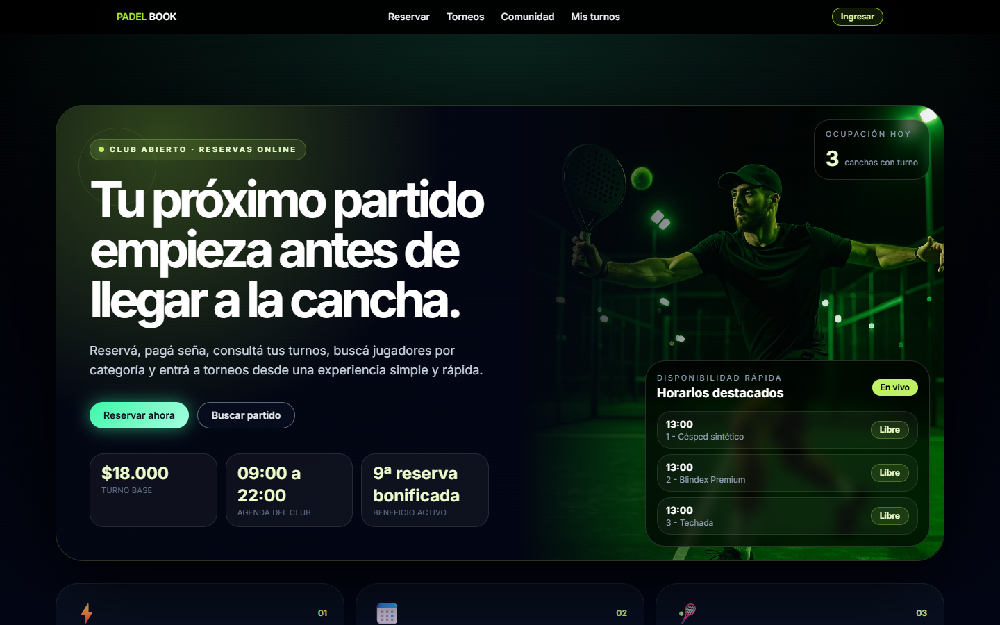
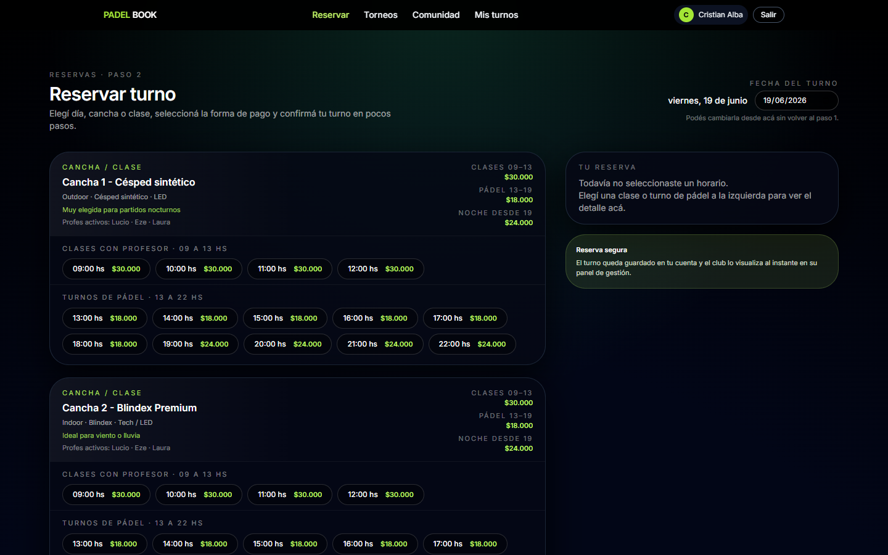
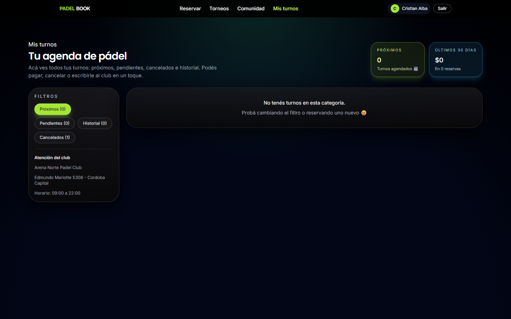
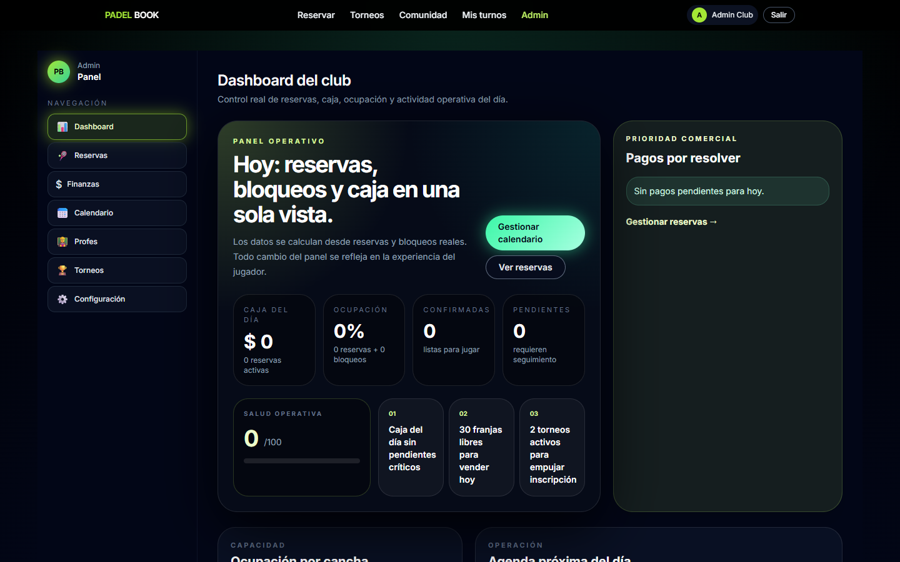
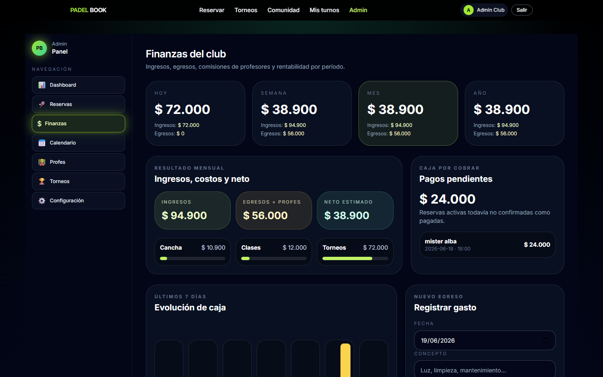

# PadelBook

PadelBook es una plataforma fullstack para clubes de pádel. Permite gestionar reservas, torneos, agenda de jugadores, clases con profesores y operación administrativa desde una experiencia web simple y clara.

El proyecto está pensado como un producto recorrible de punta a punta: el jugador puede reservar y seguir su actividad, el profesor puede revisar sus clases y disponibilidad, y el administrador puede controlar reservas, calendario, torneos, precios, pagos y métricas del club.

## Accesos de prueba

Desde el botón **Ingresar** podés cargar perfiles preparados para recorrer cada rol.

| Rol | Email | Password | Qué revisar |
| --- | --- | --- | --- |
| Jugador | `crisalba@test.com` | `player123` | Reservas, mis turnos, torneos inscriptos y panel personal |
| Profe | `lucio@club.com` | `profe123` | Clases del día, horarios y disponibilidad |
| Admin | `admin@club.com` | `admin123` | Dashboard ejecutivo, reservas, calendario, profesores, torneos y precios |

## Funcionalidades

- Home con disponibilidad, precios, beneficios y estado del club.
- Reserva de cancha o clase con profesor.
- Registro e inicio de sesión con roles.
- Agenda del jugador con reservas, pagos, cancelaciones y torneos inscriptos.
- Inscripción a torneos vinculada al perfil del jugador.
- Panel administrativo con métricas de caja, ocupación, pagos pendientes y actividad reciente.
- Módulo financiero para controlar ingresos, egresos, comisiones de profesores y neto por día, semana, mes y año.
- Gestión de reservas con filtros, estados y acción rápida por WhatsApp.
- Panel de profesores para consultar clases y bloqueos.
- Configuración del club: precios, horarios, textos y datos visibles.
- API REST conectada a MongoDB Atlas.
- Registro de egresos persistido en MongoDB.

## Stack

- React
- Vite
- TailwindCSS
- React Router
- Hooks y Context API
- Node.js
- Express
- MongoDB Atlas
- Mongoose
- JWT

## Cómo correrlo

Instalá dependencias:

```bash
npm install
```

Creá el archivo de entorno:

```bash
cp .env.example .env
```

Completá `MONGODB_URI` y `JWT_SECRET` en `.env`.

Levantá frontend y backend juntos:

```bash
npm run dev:full
```

Frontend:

```text
http://localhost:5173
```

API:

```text
http://localhost:4000/api
```

Healthcheck:

```text
http://localhost:4000/api/health
```

Build de producción:

```bash
npm run build
```

## Capturas







## Estado actual

El proyecto ya cuenta con frontend, backend, autenticación por roles y persistencia en MongoDB. Al iniciar la API, si la base está vacía, se cargan datos iniciales para poder recorrer la plataforma sin configuración manual.

Próximos pasos posibles:

- Integración real con Mercado Pago.
- Webhooks de pagos.
- Deploy productivo.
- Panel de analítica comercial más avanzado.
- Notificaciones automáticas por email o WhatsApp.

## Nota

El objetivo de PadelBook es mostrar cómo podría funcionar una herramienta real para la operación diaria de un club: reservas, clases, torneos, pagos y administración en un solo lugar.
