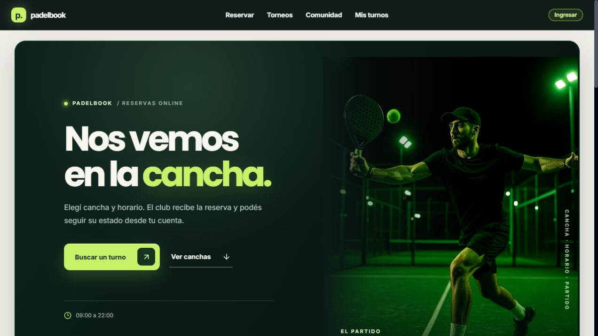
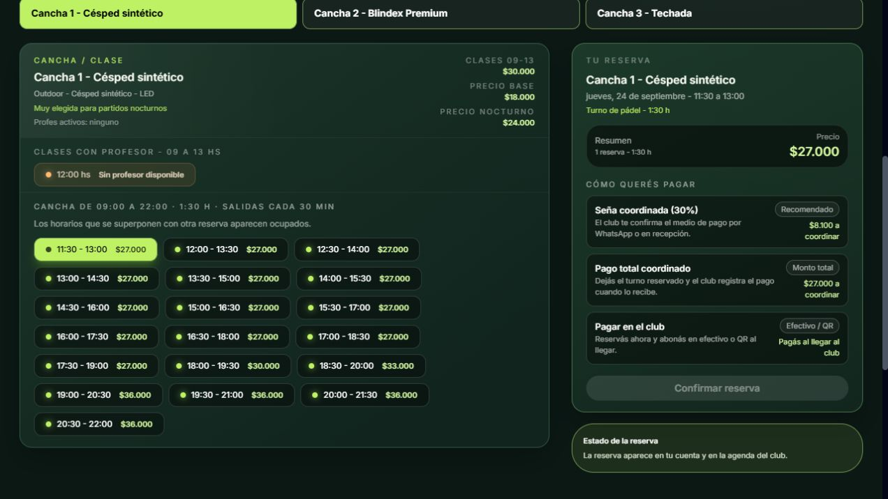
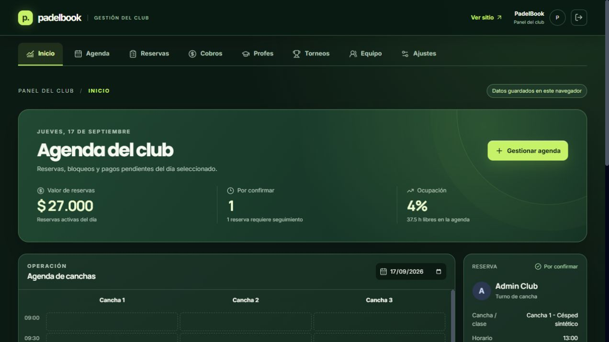

# PadelBook

Reservas y gestión diaria para clubes de pádel. Un jugador consulta la disponibilidad y solicita un turno; recepción administra la agenda y registra cobros; el dueño configura canchas, horarios, precios y accesos del equipo.

**Web:** [padelbook.crisalbavideografo.workers.dev](https://padelbook.crisalbavideografo.workers.dev) · **Estado:** instalación conectada para preparar el primer piloto en Córdoba. Todavía no se presenta como un servicio multiclub ni como una plataforma con pagos online.

## Producto

| Área | Qué permite hacer |
| --- | --- |
| Reservas | Elegir cancha, fecha y duración de 1, 1:30, 2 o 2:30 horas; ver disponibilidad y precio antes de confirmar. |
| Agenda del club | Consultar reservas y bloqueos, registrar turnos de mostrador, confirmar o cancelar y seguir saldos. |
| Configuración | Crear, editar y desactivar canchas; establecer horarios, intervalos, duraciones admitidas y precios. |
| Equipo | Dar acceso individual a recepción y profesores con permisos distintos a los del dueño. |
| Otras áreas | Torneos, comunidad, perfil del jugador, clases con profesores y caja operativa. |

Las reservas y los bloqueos reclaman franjas únicas de 30 minutos en transacciones de MongoDB para impedir que dos operaciones simultáneas ocupen el mismo horario. La API vuelve a calcular el importe y valida permisos antes de guardar cambios.

Los **cobros son manuales**: elegir seña o pago total indica cómo coordinar el pago, pero no cobra dinero. El club registra después el importe recibido. Los correos de creación, cambio y cancelación de reservas están implementados y dependen de que el proveedor de email esté configurado; el envío es asíncrono y no tiene todavía una cola con reintentos.

## Capturas actuales

Capturadas el 24 de septiembre de 2026. Inicio y reserva corresponden a la web publicada. El panel usa **datos de ejemplo locales** para no exponer información de usuarios del piloto.

| Escritorio | Celular |
| --- | --- |
| [Inicio](docs/screenshots/home-desktop.png) | [Inicio](docs/screenshots/home-mobile.png) |
| [Reserva y opciones de pago](docs/screenshots/reserva-desktop.png) | [Resumen de reserva](docs/screenshots/reserva-mobile.png) |
| [Panel del club, datos de ejemplo](docs/screenshots/panel-admin-ejemplo.png) | [Agenda del club, datos de ejemplo](docs/screenshots/agenda-admin-mobile-ejemplo.png) |







## Arquitectura

- **Interfaz:** React, Vite, React Router, Tailwind CSS y Framer Motion; publicada en Cloudflare Workers.
- **API:** Node.js y Express en Render. Cloudflare reenvía `/api` hacia ella mediante un secreto privado.
- **Datos:** MongoDB Atlas y Mongoose. La API usa transacciones para reservas y bloqueos.
- **Acceso:** sesiones en cookie `HttpOnly`, `Secure` y `SameSite=Strict` en producción; CSRF, validación de entradas, límites de intentos y autorización por rol en el servidor.
- **Operación:** pruebas automáticas y CI, healthcheck, chequeo periódico y workflow diario de backup cifrado. El procedimiento de restauración se prueba automáticamente con una base temporal; la restauración de un backup real de Atlas debe verificarse antes de operar con el club.

Más detalles y riesgos pendientes: [Arquitectura](docs/ARQUITECTURA.md), [Seguridad](docs/SEGURIDAD.md), [Backups y restauración](docs/BACKUP_RESTORE.md) y [Plan del piloto](docs/PLAN_PILOTO.md).

## Ejecutar localmente

Requiere Node.js 24 y npm. Para recorrer la interfaz con datos de ejemplo, sin conectarla al club:

```powershell
npm ci
$env:VITE_DEMO_MODE="true"
npm run dev
```

Abrí `http://localhost:5173` y elegí un perfil de prueba desde **Ingresar**. Este modo guarda cambios solo en el navegador. Nunca se debe activar en el despliegue de un club.

Para ejecutar la API con una base propia, copiá `.env.example` a `.env`, configurá MongoDB y los secretos indicados allí y usá `npm run dev:full`. Para una base nueva de club, establecé `PADELBOOK_DEMO_SEED=false` y las variables del administrador inicial. La [guía de despliegue](docs/DESPLIEGUE_PILOTO.md) incluye la puesta en marcha y la prueba de aceptación.

```powershell
npm test
npm run build
```

## Límites conocidos

- Una instalación representa **un solo club**. Para alojar varios en la misma API falta aislamiento obligatorio por `clubId`; hasta entonces se necesitan API y base separadas por club.
- No hay pasarela de cobro ni conciliación automática. Mercado Pago y sus webhooks son trabajo pendiente.
- No existe alta autoservicio de clubes. El primer club se configura de forma controlada.
- La entrega de correos requiere un remitente verificado. Todavía faltan recordatorios automáticos y seguimiento de fallos de envío.
- Antes del piloto con datos reales hay que probar la restauración del backup de Atlas, los accesos del equipo y el circuito completo de reserva y cobro con el club.

El objetivo del piloto es aprender de la operación diaria de un club real antes de ampliar el producto.
